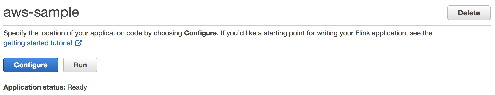

# Kinesis Data Analytics for Java Application Demo

借助Amazon Kinesis Data Analytics for Java Applications，AWS用户可以使用Java程序来处理和分析流数据，该服务使得用户能够快速创建和运行针对流数据的Java代码，用来做时间序列分析，或者提供实时仪表板、创建实时指标等。

用户可以使用基于Apache Flink（一种用于处理数据流的流行框架和引擎）的开源库在Kinesis Data Analytics中构建Java应用程序。Kinesis Data Analytics服务为Flink应用程序提供底层基础架构，处理核心组件，如配置计算资源、并行计算、自动扩展和应用程序备份（检查点和快照）。用户可以使用Flink高阶编程功能如operator，source和sink，与自己托管的Apache Flink使用方式完全相同。

要开始使用Kinesis Data Analytics for Java Applications，首先需要创建一个Kinesis Data Analytics应用程序，该应用程序可以连续读取和处理流数据，然后，依照用户的习惯选择熟悉的IDE编写Java代码，并使用实时流数据进行测试，最后将代码部署到AWS平台。

本示例是依据官方文档中的[Getting Started](https://docs.aws.amazon.com/kinesisanalytics/latest/java/getting-started.html)进行编写，供读者参考。实验一共包括以下几个步骤：
* 创建Kinesis Data Streams作为数据源和目的
* 传输示例数据到输入流
* 编写Flink Streaming Java代码并编译
* 上传Flink Streaming Java代码到S3
* 创建并运行Kinesis Data Analytics Application
* 查看处理结果

### 1.创建Kinesis Data Streams

在创建Kinesis Data Analytics for Java应用程序之前，首先需要创建两个Kinesis Data Stream，分别是ExampleInputStream和ExampleOutputStream，作为后续处理程序的输入流和输出流。用户可以使用Amazon Kinesis控制台或以下AWS CLI命令创建这些数据流。有关控制台说明，请参阅*Amazon Kinesis Data Streams开发人员指南*中的[操作说明](https://docs.aws.amazon.com/kinesis/latest/dev/amazon-kinesis-streams.html)。有关AWS CLI的说明，请参阅这里的[操作说明](https://docs.aws.amazon.com/kinesisanalytics/latest/java/setup-awscli.html)。

* 通过AWS CLI命令行创建ExampleInputStream
```
$ aws kinesis create-stream \
--stream-name ExampleInputStream \
--shard-count 1
```

* 通过AWS CLI命令行创建ExampleOutputStream
```
$ aws kinesis create-stream \
--stream-name ExampleOutputStream \
--shard-count 1
```

### 2.传输示例数据到输入流
这里我们传输一些示例数据到输入流ExampleInputStream，此处使用一段Python程序将一些股票的代码和股价发送到数据流中，这部分需要使用到[AWS SDK for Python](https://aws.amazon.com/developers/getting-started/python/)。

* 创建一个Python文件stock.py并复制以下代码：
```
import json
import boto3
import random
                        
kinesis = boto3.client('kinesis', region-name="us-east-1")
def getTicker():
    data = {}
    data['TICKER'] = random.choice(['AAPL', 'AMZN', 'MSFT', 'INTC', 'TBV'])
    price = random.random() * 100
    data['PRICE'] = str(round(price, 2))
    return data
                        
while True:
    data = json.dumps(getTicker())
    print(data)
    kinesis.put_record(
        StreamName="ExampleInputStream",
        Data=data,
        PartitionKey="partitionkey")
```
这里使用的是us-east-1的AWS region。

* 持续运行程序stock.py直到实验结束。
```
$ python stock.py
```

### 3.编写Flink Streaming Java代码并编译
在本节中，将使用Apache Maven为应用程序创建并编译Java代码，有关安装Apache Maven和JDK的信息，请参阅[这里](https://docs.aws.amazon.com/kinesisanalytics/latest/java/getting-started.html#setting-up-prerequisites)，编写的Java应用程序应包含以下组件：

- 项目对象模型文件pom.xml，此文件包含有关应用程序配置和依赖关系的信息，包括Kinesis Data Analytics for Java Applications的库。
- 应用程序逻辑的main方法。

项目（如kinesis_java）的参考目录结构如下所示：
```
kinesis_java/
|-- pom.xml
`-- src
    `-- main
        `-- java
            `-- com
                `-- amazonaws
                    `-- services
                        `-- kinesisanalytics
                            `-- StreamingJob.java
```

用户可以直接使用文本编辑器开发本示例的代码，也可以选择平时熟悉的IDE工具进行开发测试，它们都提供了相关的入门指南：
- [Ecalipse](https://help.eclipse.org/neon/index.jsp?topic=%2Forg.eclipse.jdt.doc.user%2FgettingStarted%2Fqs-3.htm)
- [IntelliJ](https://www.jetbrains.com/help/idea/creating-and-running-your-first-java-application.html)

将以下代码用于项目对象模型文件pom.xml，文件包含对Kinesis Data Analytics for Java Applications Maven库的引用，如用于处理数据的连接器connector。以下示例pom.xml文件包含Kinesis Data Analytics for Java应用程序所需的依赖项，供读者作为参考。创建应用程序时，请按照IDE文档中的创建Maven应用程序的说明进行操作。

* 复制以下内容到pom.xml文件：

```
<?xml version="1.0" encoding="UTF-8"?>
<project xmlns="http://maven.apache.org/POM/4.0.0"
         xmlns:xsi="http://www.w3.org/2001/XMLSchema-instance"
         xsi:schemaLocation="http://maven.apache.org/POM/4.0.0 http://maven.apache.org/xsd/maven-4.0.0.xsd">
    <modelVersion>4.0.0</modelVersion>

    <groupId>com.amazonaws</groupId>
    <artifactId>java-getting-started</artifactId>
    <version>1.0</version>
    <packaging>jar</packaging>

    <properties>
        <java.version>1.8</java.version>
        <scala.binary.version>2.11</scala.binary.version>
        <flink.version>1.6.2</flink.version>
        <kda.version>1.0.0</kda.version>
    </properties>

    <dependencies>

        <dependency>
            <groupId>com.amazonaws</groupId>
            <artifactId>aws-kinesisanalytics-runtime</artifactId>
            <version>${kda.version}</version>
        </dependency>


        <dependency>
            <groupId>org.apache.flink</groupId>
            <artifactId>flink-connector-kinesis_${scala.binary.version}</artifactId>
            <version>${flink.version}</version>
        </dependency>

        <dependency>
            <groupId>org.apache.flink</groupId>
            <artifactId>flink-streaming-java_${scala.binary.version}</artifactId>
            <version>${flink.version}</version>
            <scope>provided</scope>
        </dependency>

    </dependencies>

    <build>

    <plugins>

        <!-- Java Compiler -->
        <plugin>
            <groupId>org.apache.maven.plugins</groupId>
            <artifactId>maven-compiler-plugin</artifactId>
            <version>3.1</version>
            <configuration>
                <source>${java.version}</source>
                <target>${java.version}</target>
            </configuration>
        </plugin>

        <!-- We use the maven-shade plugin to create a fat jar that contains all necessary dependencies. -->
        <!-- Change the value of <mainClass>...</mainClass> if your program entry point changes. -->
        <plugin>
            <groupId>org.apache.maven.plugins</groupId>
            <artifactId>maven-shade-plugin</artifactId>
            <version>3.0.0</version>
            <executions>
                <!-- Run shade goal on package phase -->
                <execution>
                    <phase>package</phase>
                    <goals>
                        <goal>shade</goal>
                    </goals>
                    <configuration>
                        <artifactSet>
                            <excludes>
                                <exclude>org.apache.flink:force-shading</exclude>
                                <exclude>com.google.code.findbugs:jsr305</exclude>
                                <exclude>org.slf4j:*</exclude>
                                <exclude>log4j:*</exclude>
                            </excludes>
                        </artifactSet>
                        <filters>
                            <filter>
                                <!-- Do not copy the signatures in the META-INF folder.
                                Otherwise, this might cause SecurityExceptions when using the JAR. -->
                                <artifact>*:*</artifact>
                                <excludes>
                                    <exclude>META-INF/*.SF</exclude>
                                    <exclude>META-INF/*.DSA</exclude>
                                    <exclude>META-INF/*.RSA</exclude>
                                </excludes>
                            </filter>
                        </filters>
                        <transformers>
                            <transformer implementation="org.apache.maven.plugins.shade.resource.ManifestResourceTransformer">
                                <mainClass>com.amazonaws.services.kinesisanalytics.StreamingJob</mainClass>
                            </transformer>
                        </transformers>
                    </configuration>
                </execution>
            </executions>
        </plugin>
    </plugins>
    </build>

</project>
```

这里的pom.xml文件使用maven-shade插件生成一个包含其所需依赖项的jar，即*fat jar*，如果需要，可以使用任何其他生成包含依赖项的jar的插件。Kinesis Data Analytics for Java Applications在aws-kinesisanalytics-runtime库中为应用程序提供资源，该库包含Kinesis Analytics Java流处理运行时配置类。

**注：要将Kinesis连接器用于以下应用程序，需要下载连接器的源代码并按照[Apache Flink文档](https://ci.apache.org/projects/flink/flink-docs-stable/dev/connectors/kinesis.html)中的说明进行构建，参考操作步骤如下。如果直接使用Maven编译会报错找不到对应的库。**

* 首先下载Flink源码包并解压：
```
wget https://github.com/apache/flink/archive/release-1.6.2.tar.gz
tar zxvf release-1.6.2.tar.gz
```
* 切换到Flink的Kinesis Connetor目录，并使用Maven进行安装：
```
cd /home/ec2-user/flink-release-1.6.2/flink-connectors/flink-connector-kinesis
mvn clean install -DskipTests
```

* 复制以下代码到文件StreamingJob.java：
```
package com.amazonaws.services.kinesisanalytics;

import com.amazonaws.services.kinesisanalytics.runtime.KinesisAnalyticsRuntime;
import org.apache.flink.api.common.serialization.SimpleStringSchema;
import org.apache.flink.streaming.api.datastream.DataStream;
import org.apache.flink.streaming.api.environment.StreamExecutionEnvironment;
import org.apache.flink.streaming.connectors.kinesis.FlinkKinesisConsumer;
import org.apache.flink.streaming.connectors.kinesis.FlinkKinesisProducer;
import org.apache.flink.streaming.connectors.kinesis.config.ConsumerConfigConstants;

import java.io.IOException;
import java.util.Map;
import java.util.Properties;


public class StreamingJob {

    private static final String region = "us-east-1";
    private static final String inputStreamName = "ExampleInputStream";
    private static final String outputStreamName = "ExampleOutputStream";

    private static DataStream<String> createSourceFromStaticConfig(StreamExecutionEnvironment env) {
        Properties inputProperties = new Properties();
        inputProperties.setProperty(ConsumerConfigConstants.AWS_REGION, region);
        inputProperties.setProperty(ConsumerConfigConstants.STREAM_INITIAL_POSITION, "LATEST");

        return env.addSource(new FlinkKinesisConsumer<>(inputStreamName, new SimpleStringSchema(), inputProperties));
    }
    
    private static DataStream<String> createSourceFromApplicationProperties(StreamExecutionEnvironment env) throws IOException {
        Map<String, Properties> applicationProperties = KinesisAnalyticsRuntime.getApplicationProperties();
        return env.addSource(new FlinkKinesisConsumer<>(inputStreamName, new SimpleStringSchema(),
                applicationProperties.get("ConsumerConfigProperties")));
    }

    private static FlinkKinesisProducer<String> createSinkFromStaticConfig() {
        Properties outputProperties = new Properties();
        outputProperties.setProperty(ConsumerConfigConstants.AWS_REGION, region);
        outputProperties.setProperty("AggregationEnabled", "false");

        FlinkKinesisProducer<String> sink = new FlinkKinesisProducer<>(new SimpleStringSchema(), outputProperties);
        sink.setDefaultStream(outputStreamName);
        sink.setDefaultPartition("0");
        return sink;
    }
    
    private static FlinkKinesisProducer<String> createSinkFromApplicationProperties() throws IOException {
        Map<String, Properties> applicationProperties = KinesisAnalyticsRuntime.getApplicationProperties();
        FlinkKinesisProducer<String> sink = new FlinkKinesisProducer<>(new SimpleStringSchema(),
                applicationProperties.get("ProducerConfigProperties"));

        sink.setDefaultStream(outputStreamName);
        sink.setDefaultPartition("0");
        return sink;
    }

    public static void main(String[] args) throws Exception {
        // set up the streaming execution environment
        final StreamExecutionEnvironment env = StreamExecutionEnvironment.getExecutionEnvironment();

         
         /* if you would like to use runtime configuration properties, uncomment the lines below
         * DataStream<String> input = createSourceFromDynamicConfig(env);
         */
         
        DataStream<String> input = createSourceFromStaticConfig(env);


         /* if you would like to use runtime configuration properties, uncomment the lines below
         * input.addSink(createSinkFromApplicationProperties())
         */
         
        input.addSink(createSinkFromStaticConfig());

        env.execute("Flink Streaming Java API Skeleton");
    }
}
```
应用程序使用StreamExecutionEnvironment对象创建源和接收器连接器以访问外部资源，并使用静态属性创建源和接收器连接器。要想使用动态应用程序属性，请使用createSourceFromApplicationProperties和createSinkFromApplicationProperties方法创建连接器，这些方法会读取应用程序的属性以配置连接器。

* 使用Maven命令行工具进行打包（确保在项目的文件下执行）：
```
mvn package
```
除此之外，也可以通过使用的IDE进行打包。

如果执行成功，会在目录下生成如下文件：
```
target/java-getting-started-1.0.jar
```

### 4.上传Flink Streaming Java代码到S3
Kinesis Data Analytics for Java Application需要将Flink Streaming Java代码上传到S3中，这里使用AWS CLI命令行进行上传，具体的S3桶和前缀请按照自己的实际情况进行调整。
```
aws s3 cp target/java-getting-started-1.0.jar s3://<your s3 bucket>/path/to/jar
```

### 5.创建并运行Kinesis Data Analytics Application
接下来开始创建Kinesis Data Analytics Application。首先登录AWS控制台，找到Kinesis服务，在Kinesis Analytics选择创建应用程序，输入application名字为*aws-sample*，Runtime选择*Flink 1.6*，然后选择创建新的IAM角色。如下图所示：


然后需要编辑下刚刚的IAM权限，添加对输入流ExampleInputStream和输出流ExampleOutputStream的访问权限。选择刚刚创建好的aws-sample，在详细信息中可以看到新创建的IAM角色，点击链接会跳转到IAM界面。


点击其中的policy（名称应为kinesis-analytics-service-aws-sample-us-east-1）


编辑策略，参考以下内容：
```
{
    "Version": "2012-10-17",
    "Statement": [
        {
            "Sid": "ReadCode",
            "Effect": "Allow",
            "Action": [
                "s3:GetObject",
                "s3:GetObjectVersion"
            ],
            "Resource": [
                "arn:aws:s3:::<your s3 bucket>/path/to/jar"
            ]
        },
        {
            "Sid": "ListCloudwatchLogGroups",
            "Effect": "Allow",
            "Action": [
                "logs:DescribeLogGroups"
            ],
            "Resource": [
                "arn:aws:logs:us-east-1:012345678901:log-group:*"
            ]
        },
        {
            "Sid": "ListCloudwatchLogStreams",
            "Effect": "Allow",
            "Action": [
                "logs:DescribeLogStreams"
            ],
            "Resource": [
                "arn:aws:logs:us-east-1:012345678901:log-group:/aws/kinesis-analytics/aws-sample:log-stream:*"
            ]
        },
        {
            "Sid": "PutCloudwatchLogs",
            "Effect": "Allow",
            "Action": [
                "logs:PutLogEvents"
            ],
            "Resource": [
                "arn:aws:logs:us-east-1:012345678901:log-group:/aws/kinesis-analytics/aws-sample:log-stream:kinesis-analytics-log-stream"
            ]
        },
        {
            "Sid": "ReadInputStream",
            "Effect": "Allow",
            "Action": "kinesis:*",
            "Resource": "arn:aws:kinesis:us-east-1:012345678901:stream/ExampleInputStream"
        },
        {
            "Sid": "WriteOutputStream",
            "Effect": "Allow",
            "Action": "kinesis:*",
            "Resource": "arn:aws:kinesis:us-east-1:012345678901:stream/ExampleOutputStream"
        }
    ]
}
```
其中需要注意的是S3的桶的jar包的路径、AWS账户、CloudWatch的log group名称，以及最后两段关于数据流的权限。

接下来在aws-sample应用中点击configure，如下图所示：


按照上传的S3路径设置Java应用程序的位置，然后选择刚刚创建的IAM角色，如下图所示：


开启CloudWatch日志，然后选择ERROR级别，点击update，如下图所示：


等待配置更新成功后，点击Run运行程序，如下图所示：


等待一段时间，刷新页面，查看应用程序运行图。


### 6.查看处理结果
最后，到Kinesis数据流中查看处理结果，这里使用AWS CLI进行查看。

首先，查看输出流ExampleOutputStream的shard，有关Kinesis的相关概念，请参考[这里](https://docs.aws.amazon.com/streams/latest/dev/key-concepts.html)。
```
$ aws kinesis get-shard-iterator --shard-id shardId-000000000000 --shard-iterator-type TRIM_HORIZON --stream-name ExampleOutputStream
{
    "ShardIterator": "AAAAAAAAAAGk6dLJmmkGCZf4Jb5ND1U/fNJKe9RtNf2NTsV604xTVTBn7xXprSuo6hbdx8Cyfx5lmcLOHkccIlh/jwXpqbNncHa+sJTMK4s6SpT0aFa3OChXBbRdNi3T7+1A4lWbGLQDYGs6nibols/T4ycDlWOb/yYl52zcac37sX13AQiX8l8oZnXaBz1lcoDzMTNpyAv7uJwaf7y6vpVoyWQ6s10at/8EHgrZEgGfaYvQErHANA=="
}
```

然后使用刚刚的iterator获取流数据：
```
aws kinesis get-records --shard-iterator AAAAAAAAAAGk6dLJmmkGCZf4Jb5ND1U/fNJKe9RtNf2NTsV604xTVTBn7xXprSuo6hbdx8Cyfx5lmcLOHkccIlh/jwXpqbNncHa+sJTMK4s6SpT0aFa3OChXBbRdNi3T7+1A4lWbGLQDYGs6nibols/T4ycDlWOb/yYl52zcac37sX13AQiX8l8oZnXaBz1lcoDzMTNpyAv7uJwaf7y6vpVoyWQ6s10at/8EHgrZEgGfaYvQErHANA==
```
可以看到输出信息类似以下内容：
```
        ...
        
        {
            "Data": "eyJQUklDRSI6ICIyNi43MiIsICJUSUNLRVIiOiAiSU5UQyJ9", 
            "PartitionKey": "0", 
            "ApproximateArrivalTimestamp": 1544272509.374, 
            "SequenceNumber": "49590869158258093356086549590436069091686336058884096002"
        }, 
        {
            "Data": "eyJQUklDRSI6ICI0Ny43OSIsICJUSUNLRVIiOiAiSU5UQyJ9", 
            "PartitionKey": "0", 
            "ApproximateArrivalTimestamp": 1544272509.374, 
            "SequenceNumber": "49590869158258093356086549590437278017505950688058802178"
        }, 
        {
            "Data": "eyJQUklDRSI6ICIxMy4xIiwgIlRJQ0tFUiI6ICJBQVBMIn0=", 
            "PartitionKey": "0", 
            "ApproximateArrivalTimestamp": 1544272509.374, 
            "SequenceNumber": "49590869158258093356086549590438486943325565317233508354"
        }
        
        ...
```

数据是经过base64编码，可以通过程序进行解码：
```
$ echo "eyJQUklDRSI6ICI0Ny43OSIsICJUSUNLRVIiOiAiSU5UQyJ9" | base64 -d
{"PRICE": "47.79", "TICKER": "INTC"}
```

### 小结
Kinesis Data Analytics for Java Application充分利用Flink流处理框架，可以让用户在流数据处理方面变得更加的灵活，同时用户也无需管理底层的基础设施，AWS会根据负载弹性地扩展，极大地减轻了运维负担。本示例作为学习Kinesis Data Analytics for Java Application的一个基本参考，读者可以根据上述示例代码进行更多更高级的自定义开发。

**注：可以根据自己的实际情况清理资源（Kinesis、S3、IAM等）。**

### 参考文档：
- 概念介绍：https://docs.aws.amazon.com/kinesisanalytics/latest/java/what-is.html
- 入门指南：https://docs.aws.amazon.com/kinesisanalytics/latest/java/getting-started.html
- Flink Kinesis连接器：https://ci.apache.org/projects/flink/flink-docs-stable/dev/connectors/kinesis.html
